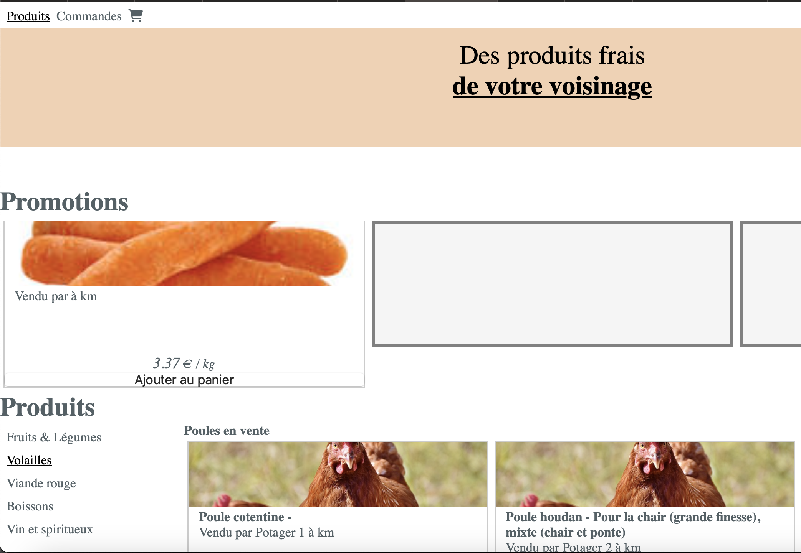

# Socarotte on K8S (localhost)

Objective: run a database-less version of socarotte on a local k8s cluster.

## Pre-requisite

- Install [docker](https://www.docker.com/get-started/)
- Install [kind](https://kind.sigs.k8s.io/docs/user/quick-start/#installation)
- Install [kubectl](https://kubernetes.io/docs/tasks/tools/)

Optional, to have a UI tool for k8s, you can install Either:

- [OpenLens](https://github.com/MuhammedKalkan/OpenLens#installation) a UI to view your k8s cluster
- [k9s](https://k9scli.io/topics/install/) if you prefer UI in terminal

## Create the kind-socarotte cluster

Create a new local cluster for this workshop:
```sh
$ kind create cluster --name socarotte
```

## Run your k8s deployments

Run the two yaml file describing ressources we want to apply on the local k8s cluster:
```sh
$ kubectl apply -f deploy-socarotte-backend.yml -f deploy-socarotte-frontend.yml
```

## Access your application on localhost using `port-forward`

To access your running application, you should expose your services on a port of your local host.

From two different terminal window:
```sh
# Port forward socarotte frontend
$ kubectl port-forward service/socarotte-frontend-service 8080:80
```

```sh
# port forward socarotte backend
$ kubectl port-forward service/socarotte-backend-service 3000:80
```

You should be able to access socarotte on [localhost:8080](http://localhost:8080)


> Note: Socarotte frontend docker image is set to reach backend on localhost:3000; so it won't work if 
> you change the port-forward local port

> Note 2: You may need to wait a bit before using `port-forward` for your service to be alive.
> if you start the `port-forward` too soon, you may see an error like `error: unable to forward port because pod is not running. Current status=Pending`
